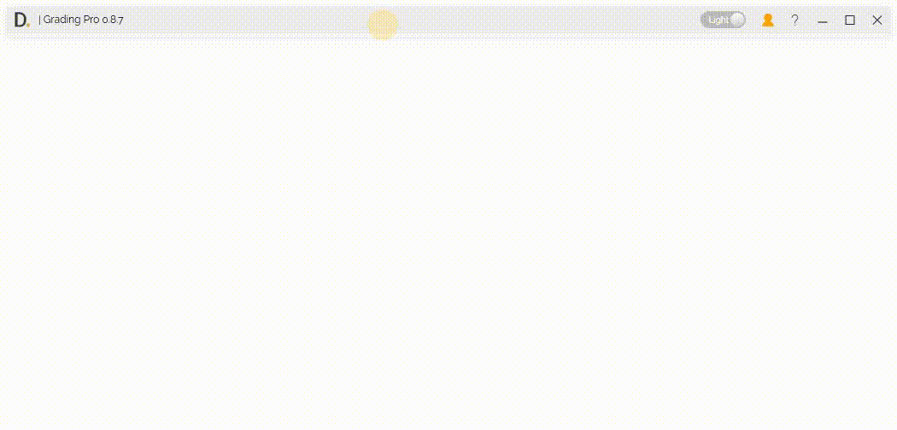
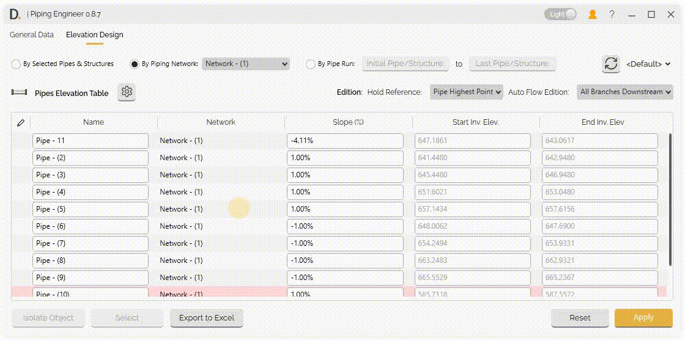
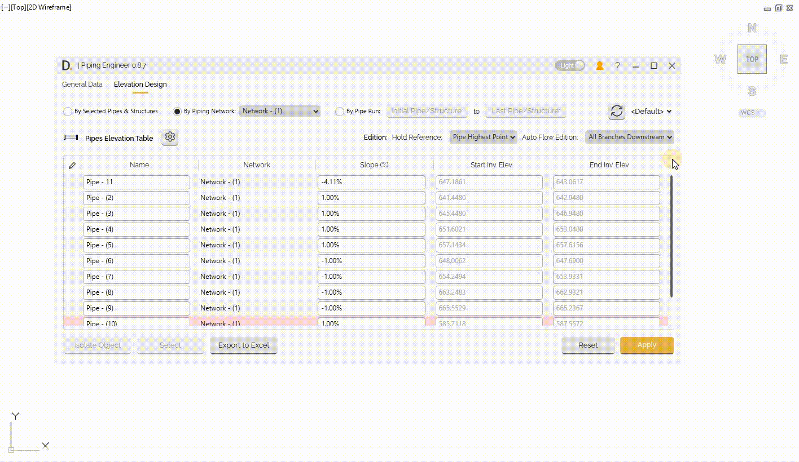
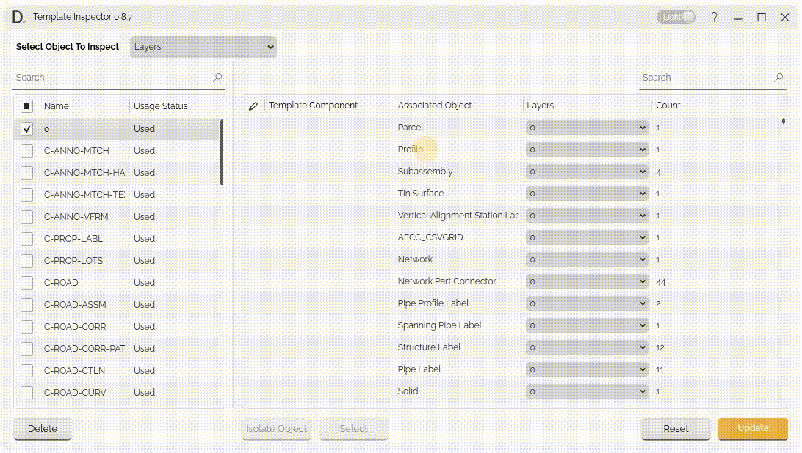
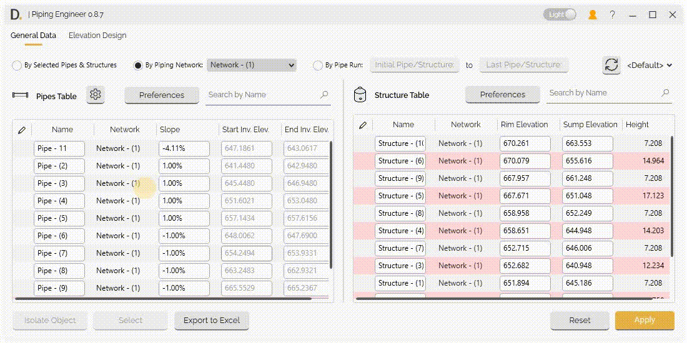
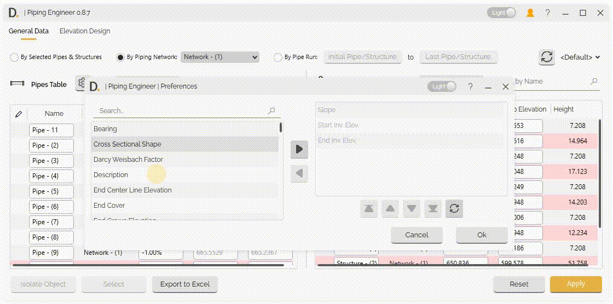
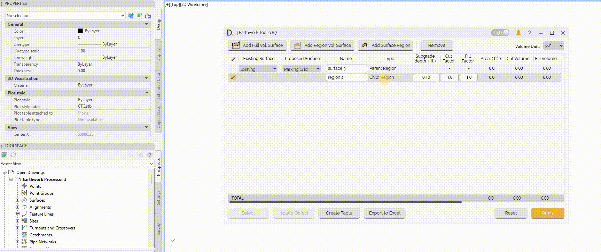

# How to use it
{: .no_toc }

Now that you know DiCivil and have installed it, let's learn some good practices for using the plugins in the package. These tips can help you improve your work and save a lot of time.
{: .fs-6 .fw-300 }

## Table of contents
{: .no_toc .text-delta }

1. TOC
{:toc}

---

## Collapse and Expand window

DiCivil plugins allow you to work with Civil 3D while keeping the plugin window open, but you can get more space to work with Civil 3D. All you have to do is double-click on the window header to Collapse and Expand it.

Note: the version on the image may not reflect the [latest version of DiCivil Package](https://diroots.com/civil-3d-plugins/dicivil/).

## Reset Functionality

You can easily undo any changes you've made before confirming them by using the Reset functionality. This feature lets you safely revert edits and prevent unwanted modifications from being applied, giving you confidence to experiment without risk before applying changes.

Note: the version on the image may not reflect the [latest version of DiCivil Package](https://diroots.com/civil-3d-plugins/dicivil/).

## Resize Window

Mouse over the edges of the window and click and drag to extend or reduce the window. Note that, there is a limit to how much you can reduce the window, to ensure that all the information in the window is displayed.

Note: the version on the image may not reflect the [latest version of DiCivil Package](https://diroots.com/civil-3d-plugins/dicivil/).

## Sort Columns

Click on the column header and sort it by number or alphabetically.  Note that not all the tables can be sorted, to ensure its correct behavior.

Note: the version on the image may not reflect the [latest version of DiCivil Package](https://diroots.com/civil-3d-plugins/dicivil/).

## Select multiple rows

DiCivil plugins have a great advantage for making bulk actions and saving time. To make it simpler, you don't need to select row by row. Just select one, press the Shift button on your keyboard, and then select the last row. Now you have several rows selected to perform the batch actions.

<!-- 
Note: the version on the image may not reflect the [latest version of DiCivil Package](https://diroots.com/civil-3d-plugins/dicivil/). -->

## Double-click in Preferences User Interface

The Preferences User Interface allows the users to add or remove properties to the table of reference. Double-click on the properties or multiple properties to move them to the right or left container.

Where to do this:

1. Style Helper.

2. Transfer Object Layers.

3. Transfer Survey Standards.

Note: the version on the image may not reflect the [latest version of DiCivil Package](https://diroots.com/civil-3d-plugins/dicivil/).

## Right-click on the row: Context menu

You can take certain actions on the table rows you have added or created by right-clicking on the data and viewing the available options.

Note: the version on the image may not reflect the [latest version of DiCivil Package](https://diroots.com/civil-3d-plugins/dicivil/).
