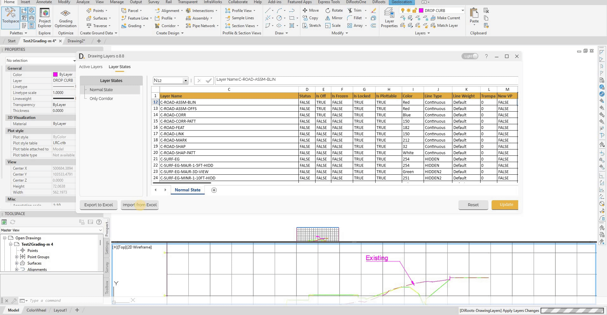

# Export/Import to Excel
{: .no_toc }

## Table of contents
{: .no_toc .text-delta }

1. TOC
{:toc}

---

# Export/Import to Excel

Drawing Layers provides import and export capabilities that allow you to export layer data to Excel for external editing, analysis, and standardization or backup purposes, as well as import updated layer data with change detection feature.

## Overview

Export and import functionality allows you to:
- Export layer data to Excel format for external editing.
- Import updated layer data from Excel files.
- Detect changes in imported data.
- Review and validate changes before applying.

## Export Process

### Export to Excel

Export data for external editing:

- **Layers Export** - Export layers data to Excel.
- **File Saving** - Save Excel file with layer data.
- **External Editing** - Edit data in Excel environment.
- **Data Preservation** - Preserve all layer data and properties.

### Export Workflow

1. **Select Data** - Choose data to export (for individual use or collaboration).
2. **Configure Export** - Set export options and settings.
3. **Choose Location** - Select file save location.
4. **Execute Export** - Perform the export operation.
5. **Verify Export** - Verify exported data integrity.
6. **Share & Collaborate** - Share file with team members for external editing (optional).
7. **Collect Updates** - Collect changes from team members and import back to tool (optional).

Note: the version on the image may not reflect the [latest version of DiCivil Package](https://diroots.com/civil3D-plugins/DiCivil/).

## Import Process

### Standard Import Process

The import process provides comprehensive data import capabilities with automatic change detection and flexible configuration options:

- **File Selection** - Select Excel file for import (updated data or team member files).
- **Import Configuration** - Configure import parameters, data mapping, and validation rules.
- **Change Detection** - Automatically detect and highlight changes with color coding.
- **Data Selection** - Choose specific data subsets, partial imports, or filtered data sets.
- **Change Review** - Review detected changes with visual indicators and summary.
- **Validation** - Validate imported data and detected changes for accuracy.
- **Custom Options** - Create custom import configurations as needed.

### Import Workflow

1. **Select File** - Choose Excel file to import (from team members or updated data).
2. **Configure Import** - Set import options and settings.
3. **Review Changes** - Review detected changes with color highlighting (changed values highlighted in green).
4. **Validate Data** - Validate imported data and changes.
5. **Apply Changes** - Apply verified changes to layer data.

Note: the version on the image may not reflect the [latest version of DiCivil Package](https://diroots.com/civil3D-plugins/DiCivil/).
