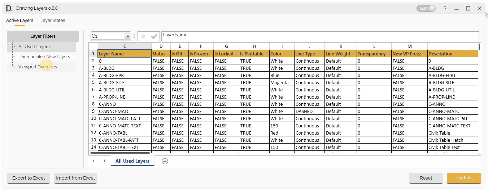

# Spreadsheet Interface
{: .no_toc }

## Table of contents
{: .no_toc .text-delta }

1. TOC
{:toc}

---

# Spreadsheet Interface

Drawing Layers provides a familiar spreadsheet interface for editing layer data and layer states directly within the application, making it easy to manage and modify your layer information.

## Overview

The spreadsheet interface offers Excel-like functionality for editing layer data, including formula support. The interface is organized into two main tabs: Active Layers and Layer States, providing comprehensive layer edition capabilities.

## Active Layers Tab

The Active Layers tab is the main spreadsheet interface for editing all used layer data.

### Editing Workflow

Edit layer data in two simple steps:

#### 1. Select Layer Filter

Begin by selecting the desired layer filter to display a specific set of layers in the spreadsheet:

- **Filter Selection** - Choose a filter to narrow down the layers shown. Easily find and click on the relevant layer filter for editing.

#### 2. Layer Property Editing

Edit layer properties directly in the spreadsheet interface:

- **Layer Names** - Edit layer names and identifiers.
- **Color Settings** - Modify layer colors.
- **Linetype Properties** - Change linetype settings.
- **Other Properties** - Edit any layer property value.

Note: the version on the image may not reflect the [latest version of DiCivil Package](https://diroots.com/civil3D-plugins/DiCivil/).

###  Adding Layers
The spreadsheet interface allows you to add new layers and remove existing layers directly from the Excel format UI.

You can add new layers to your document in two ways:

##### Add from Spreadsheet Interface

Add new layers directly from the spreadsheet interface:

- **Right-Click Menu** - Right-click on the side rows and select "Add New Row" to insert a new row in the spreadsheet.
- **Automatic Layer Creation** - When a new row is assigned a name, the system automatically creates the corresponding new layer in the document with the default values unless assigned them.

##### Add from Excel Import

When importing layer data from an Excel file:
- **New Layer Detection** - The system automatically identifies when a new layer is added that doesn't exist in the current document.

Note: the version on the image may not reflect the [latest version of DiCivil Package](https://diroots.com/civil3D-plugins/DiCivil/).

## Layer States Tab

The Layer States tab provides spreadsheet interface for editing layer states properties within the Drawing Layers application.

### State Editing Workflow

Manage layer states in two simple steps:

#### 1. Select Layer States

Begin by selecting the layer states you want to edit:

- **State Identification** - Find and select the desired layer states from the list.

#### 2. Modify State Data

Once selected, modify the properties of the chosen layer states directly in the spreadsheet interface:

- **Edit Properties** - Change layer names, color and linetype overrides, visibility (on/off, freeze/thaw, lock/unlock), and plot settings.
- **In-Place Editing** - All changes are made directly in the spreadsheet for fast and comprehensive management.

Note: the version on the image may not reflect the [latest version of DiCivil Package](https://diroots.com/civil3D-plugins/DiCivil/).

## Spreadsheet Interface Features

### Grid Layout

Familiar spreadsheet format with rows and columns:

- **Row and Column Structure** - Standard spreadsheet grid layout.
- **Direct Cell Editing** - Click and edit data directly in cells.
- **Navigation** - Navigate through data using standard spreadsheet controls.
- **Selection** - Select individual cells, rows, or columns.

Note: the version on the image may not reflect the [latest version of DiCivil Package](https://diroots.com/civil3D-plugins/DiCivil/).

### Formula Support
Excel-like formula functionality:

Note: the version on the image may not reflect the [latest version of DiCivil Package](https://diroots.com/civil3D-plugins/DiCivil/).

### Visual Change Tracking

Track changes with visual indicators:

When you make changes in the spreadsheet interface, any modified values are immediately highlighted in green, making it easy to spot edits. 

Note: the version on the image may not reflect the [latest version of DiCivil Package](https://diroots.com/civil3D-plugins/DiCivil/).

### Bulk Operations

Efficient bulk editing capabilities:

Bulk operations in the Active Layers tab allow you to efficiently edit multiple layers at once. You can select several cells simultaneously to perform edits across a range of data. Formulas can be applied to multiple rows, enabling quick and consistent updates to layer properties.

