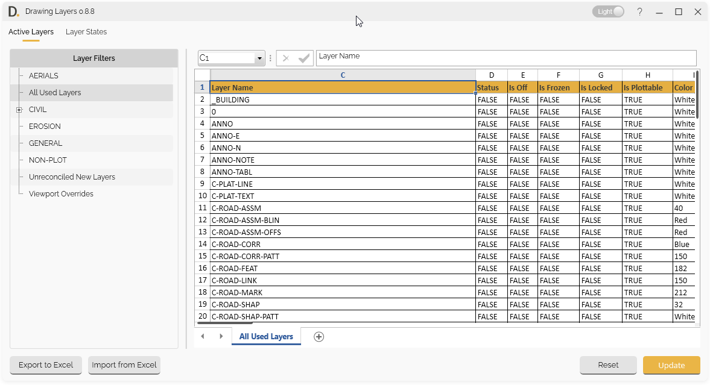
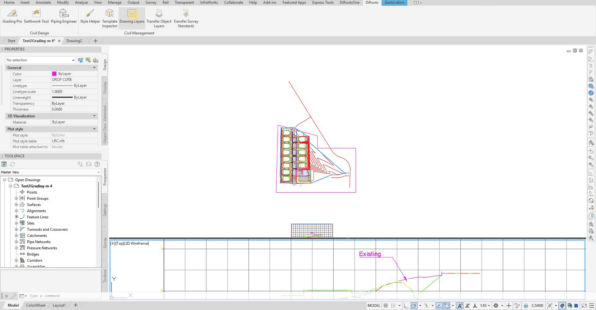

# Drawing Layers User Guide

Learn how to use Drawing Layers to edit layer data and layer states using a spreadsheet-format interface, with Excel export and import capabilities.

{: .fs-6 .fw-300 }

## Overview

Drawing Layers provides a powerful spreadsheet-format interface for editing layer data and layer states. The tool features two main tabs (Active Layers and Layer States) and allows you to manage your layer and state data efficiently using a familiar spreadsheet interface, complete with formula features, and enables export and import data to Excel for external editing.

**Key Features:**
- **Active Layers and Layer States** - Handles Active Layers and Layer States data.
- **Spreadsheet Interface** - Direct data editing in spreadsheet interface with Excel like formula support.
- **Formula Capabilities** - Concatenate columns, add prefixes, expand formulas.
- **Excel Export/Import** - Export to Excel and import with change detection.
- **Layer State Management** - Edit layer states and properties.

## Getting Started

### Main Interface

The Drawing Layers tool opens with two main tabs:

- **Active Layers Tab** - Access and edit all used layers.
- **Layer States Tab** - Edit layer states properties data.

  
<b>Image:</b> Main interface of Drawing Layers showing basic navigation 
Note: the version on the image may not reflect the [latest version of DiCivil Package](https://diroots.com/Civil3D-plugins/DiCivil/).

### Basic Workflow

1. **Open Drawing Layers** - From the DiRoots tab.
2. **Choose Tab** - Select Active Layers or Layer States tab.
3. **Choose Filter or Layer State** - For Active Layers select the filter or the Layer States.
4. **Edit Data** - Modify layer data directly in the spreadsheet interface.
5. **Use Formulas** - Apply formulas for bulk operations.
6. **Review Changes** - Check highlighted changes before applying.
7. **Apply Updates** - Confirm and apply changes to layer data.

Note: the version on the image may not reflect the [latest version of DiCivil Package](https://diroots.com/civil3D-plugins/DiCivil/).