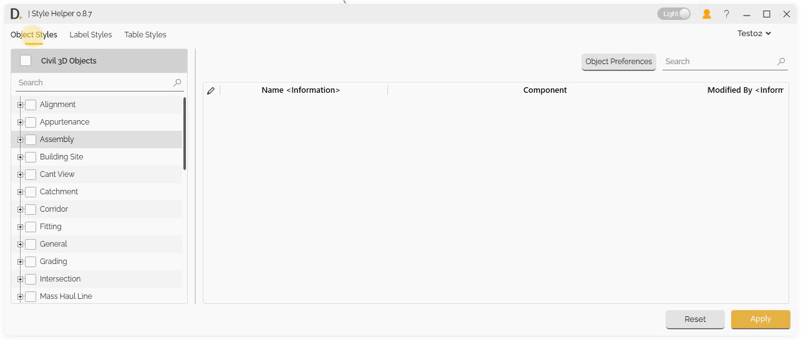
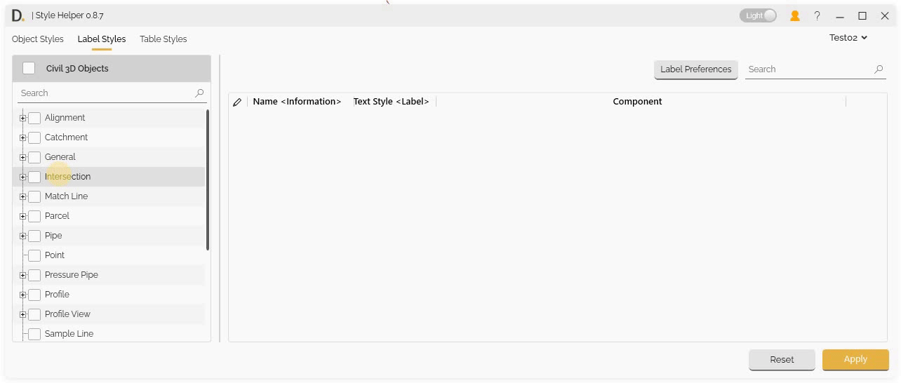
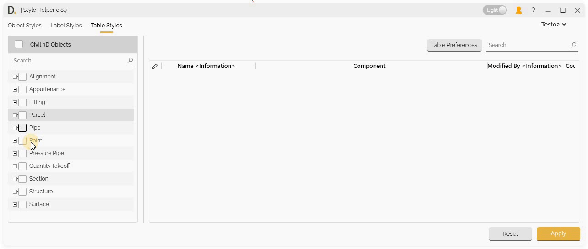
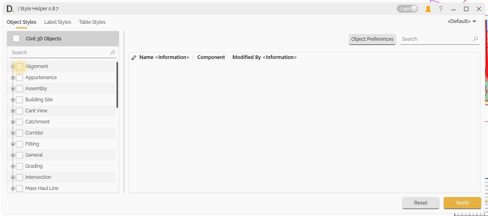
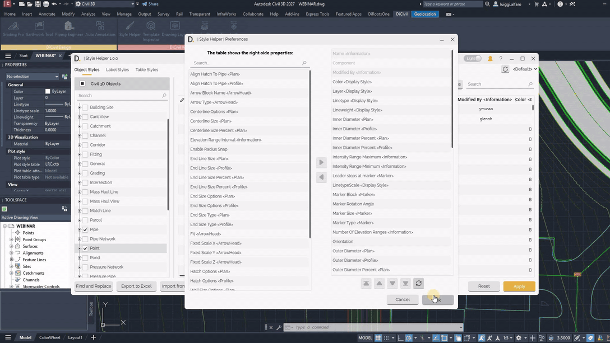
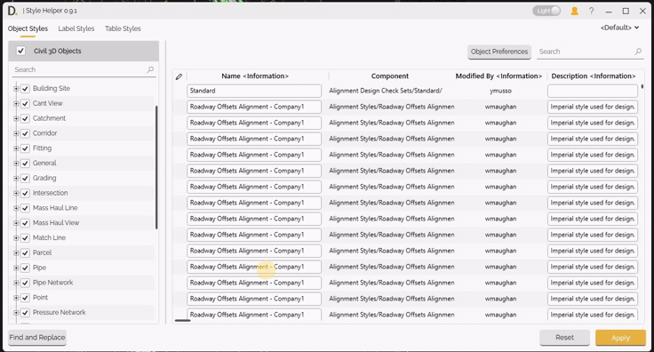

# Editing Features
{: .no_toc }

## Table of contents
{: .no_toc .text-delta }

1. TOC
{:toc}

---

# Editing Features

Style Helper provides comprehensive editing capabilities for customizing table data, editing style data properties, and performing batch operations for efficient data editing.

## Overview

The editing features include:
- **Table Column Preferences** - Configure table structure and data display.
- **Data Editing** - Edit style properties for all three tabs.
- **Batch Editing** - Edit multiple objects and rows simultaneously.
- **Export/Import from Excel** - Export style data to Excel for bulk editing and import changes back.
- **Find and Replace** - Find and replace property values quickly across selected columns.
- **Children Styles Support** - Edit children nested label styles.

## Table Customization

### Customizing Table Data Structure

Style Helper allows you to customize the table structure to show only the data you need:

#### Preferences Button
- **Independent Control** - Each tab has its own Preferences button for column configuration.
- **Dynamic Configuration** - Available column options change based on checked objects.
- **Tab-Specific Settings** - Column settings are configured independently for each tab.

#### Column Preferences
After accessing the preferences, you can:
- **Add Columns** - By adding new properties adds new columns.
- **Remove Columns** - Remove unnecessary columns.
- **Reorder Columns** - Arrange columns in preferred order.

Note: the version on the image may not reflect the [latest version of DiCivil Package](https://diroots.com/civil-3d-plugins/dicivil/).

## Data Editing for the Different Tabs

### Styles Tab Editing

Edit Civil 3D object style property data directly in the table:

#### Editing Property Data Process

1. **Access the Tab** - Open the Styles tab you want to edit.
2. **Check Objects** - Check specific objects to work with.
3. **Configure Columns** - Use Preferences button to configure table columns.
4. **Edit Properties** - Modify style properties directly in the table.
5. **Save Changes** - Changes are applied.

Note: the version on the image may not reflect the [latest version of DiCivil Package](https://diroots.com/civil-3d-plugins/dicivil/).

Note: the version on the image may not reflect the [latest version of DiCivil Package](https://diroots.com/civil-3d-plugins/dicivil/).

Note: the version on the image may not reflect the [latest version of DiCivil Package](https://diroots.com/civil-3d-plugins/dicivil/).

## Batch Editing

### Multiple Row Data Editing

Edit multiple objects, style or table rows simultaneously for efficient workflow:

#### Selection Process
- **Multi-selection** - Select multiple rows in the table.
- **Bulk Modifications** - Apply changes to one column object and the change will be propagated to the set of selected rows at once.
- **Efficiency** - Save time with bulk operations.
- **Visual Validation** - See which objects or rows are affected by changes based on the status column.
- **Apply Changes** - Apply changes to the modified items.

Note: the version on the image may not reflect the [latest version of DiCivil Package](https://diroots.com/civil-3d-plugins/dicivil/).

### Main Component–Subcomponent Relationships in Batch Editing

Since the tool displays all subcomponents, some data may be associated with the main component. Editing a property of the main component can affect multiple rows, because the main component controls several subcomponents.

#### Understanding Main Component–Subcomponent Data
- **Main Component Properties** – Some data belongs to the main component.
- **Subcomponents** – Subcomponents have their own specific data.
- **Multiple Row Impact** – Editing main component properties can impact multiple rows.

#### Main Component Property Editing
- **Main Component Changes** – Changes to main component properties affect all related subcomponents.
- **Cascading Updates** – Updates to the main component automatically update its subcomponents.
- **Bulk Modifications** – Modify main component properties to update several subcomponents at once.

> **Note:** To identify which rows represent subcomponents or main components during batch editing, refer to the **Component** column in the table. The structure and naming in the Component column are explained in the following reference: [Component Column Reference](SH-Object-Label-Table-Styles.md#component-column-reference)

<!-- 
Note: the version on the image may not reflect the [latest version of DiCivil Package](https://diroots.com/civil-3d-plugins/dicivil/). -->

## Export/Import from Excel

Style Helper provides export and import capabilities that allow you to export style data to Excel for external editing, standardization, or collaboration, and import updated data back into Civil 3D.

### Overview

Export and import functionality allows you to:
- Export style data from Object Styles, Label Styles, and Table Styles tabs to Excel format.
- Configure which properties are included using the Preferences button before export.
- Edit editable properties in Excel (such as Color, Layer, and Linetype under Display Style).
- Keep read-only properties protected (properties marked as Information are not updated on import).
- Import updated style data from Excel files.
- Review and apply imported changes in the Style Helper table before updating the drawing.

### Export Process

#### Export to Excel

Export style data for external editing:

- **Style Data Export** - Export the current table data to an Excel workbook.
- **Column Configuration** - Include only the properties configured in Preferences.
- **File Saving** - Save the Excel file to your chosen location.
- **External Editing** - Edit editable property values in Excel.

#### Export Workflow

1. **Open Style Helper** - From the DiRoots tab.
2. **Select Tab** - Choose Object Styles, Label Styles, or Table Styles.
3. **Check Objects** - Select the Civil 3D object categories to include (for example, Pipe and Point).
4. **Configure Columns** - Use the Preferences button to choose which properties appear in the table and export.
5. **Export to Excel** - Click **Export to Excel** and save the workbook.
6. **Edit in Excel** - Modify editable property values in the exported file.

### Import Process

#### Standard Import Process

The import process updates Style Helper with data from an edited Excel file:

- **File Selection** - Select the Excel file to import.
- **Read-Only Protection** - Information properties and other read-only fields are not updated.
- **Data Review** - Review imported values in the Style Helper table.
- **Change Application** - Apply verified changes to update styles in the drawing.

#### Import Workflow

1. **Select File** - Click **Import from Excel** and choose the updated workbook.
2. **Review Data** - Verify imported values in the Style Helper table.
3. **Apply Changes** - Click **Apply** to update the drawing with the imported style data.

Note: the version on the image may not reflect the [latest version of DiCivil Package](https://diroots.com/civil-3d-plugins/dicivil/).

## Find and Replace

The Find and Replace feature allows you to quickly find current editable property values and replace them across multiple columns, making bulk editing operations more efficient.

### Overview

Style Helper provides a find and replace functionality that enables you to:
- Find specific text values in selected columns
- Replace found values with new text
- Add prefixes and suffixes to values
- Apply changes only to selected rows (optional)
- Work with multiple columns simultaneously

### How It Works

The Style Helper feature includes the following options:

#### Find on Columns
- **Multiselection Dropdown** - Select the columns where you want to search for values. You can select multiple columns to perform the find and replace operation.

#### Find and Replace Inputs
- **Find** - Enter the text value you want to find in the selected columns.
- **Replace** - Enter the new text value that will replace the found text.
- **Prefix** - Optional text to add at the beginning of the replaced value.
- **Suffix** - Optional text to add at the end of the replaced value.

**Example:**
- Current Text value: `ABC_TextToFind_1`
- Find: `TextToFind`
- Replace: `ReplacedText`
- Prefix: `Prefix-`
- Suffix: `-Suffix`
- Edited text value: `Prefix-ABC_ReplacedText_1-Suffix`

#### Find Only on Selected Rows
- **Boolean Option** - When enabled, the find and replace operation applies only to currently selected rows in the table. When disabled, the operation applies to all rows in the table.

### Usage

1. **Select Rows (Optional)** - If you want to limit the operation to specific rows, select them in the table first.
2. **Enable Find Only on Selected Rows(Optional)** - Check this option if you want to restrict the operation to selected rows only.
3. **Select Columns** - Use the "Find on Columns" multiselection dropdown to choose one or more columns where you want to search.
4. **Enter Find Value** - Type the text you want to find in the Find field.
5. **Enter Replace Value** - Type the replacement text in the Replace field.
6. **Add Prefix/Suffix (Optional)** - If needed, enter prefix and/or suffix values.
7. **Apply Changes** - The values are edited in the main UI and marked as edited status. Values are applied when you apply changes in the main UI.

**Important Notes:**

- Values are applied only when the user applies changes in the main UI.
- The operation works with editable properties only.

Note: the version on the image may not reflect the [latest version of DiCivil Package](https://diroots.com/civil-3d-plugins/dicivil/).

## Missing Object Limitations

Due to current Civil 3D API limitations, Style Helper cannot collect the following style types:

- **Section View Styles** - Drafting buffer outline.
- **Rail Turnout** - All rail turnout related styles.
- **Can't View Styles** - Equilibrium can't line annotation, Applied can't line annotation.
- **Bridge Styles** - All bridge related styles.

These limitations are imposed by the Civil 3D API and are not within the control of Style Helper. We continue to monitor API updates and will add support for these styles when they become available through the Civil 3D API.

## Label Styles Children Component Editing

Style Helper supports children label styles editing capabilities.

Civil 3D has hierarchical component structures for label styles:

- **Parent label Styles** - Main style objects (e.g., Point Label Styles)
- **Child Label Style** - Inside the parent label style it could have additional nested children and subchildren label styles. We are also supporting these.

<!-- 
Note: the version on the image may not reflect the [latest version of DiCivil Package](https://diroots.com/civil-3d-plugins/dicivil/). -->