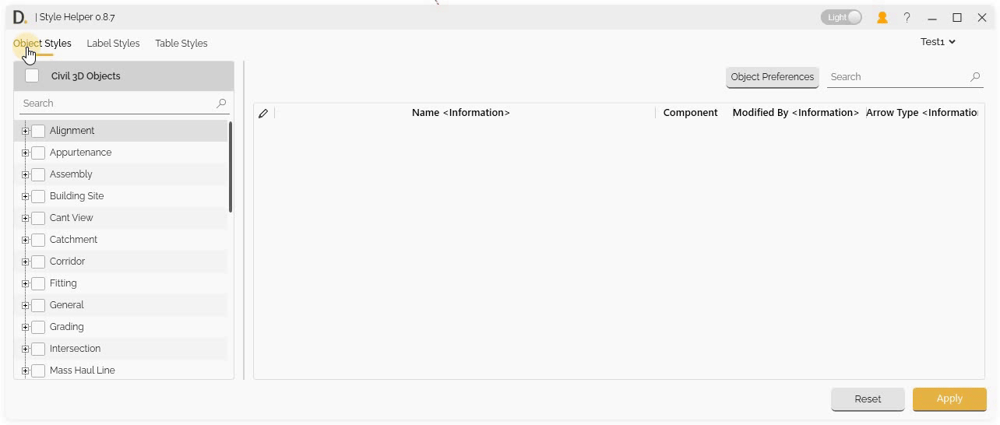
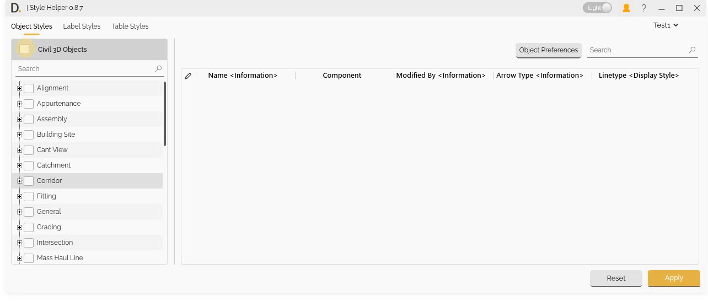
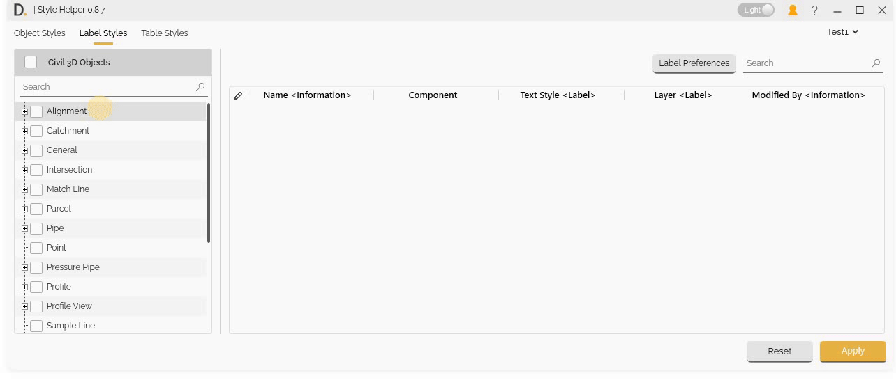
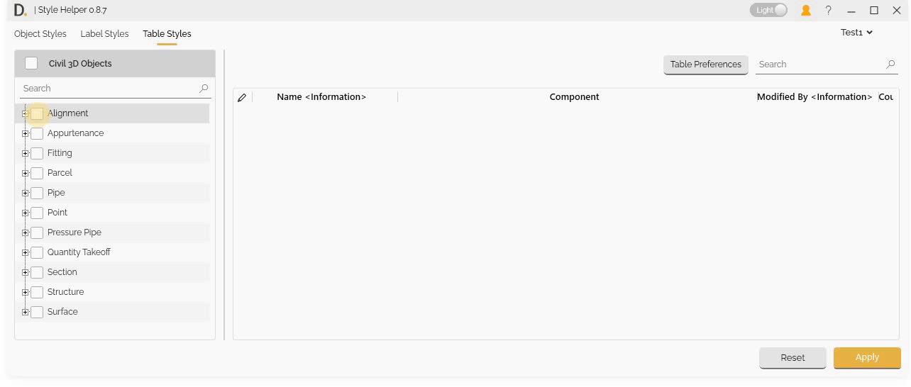
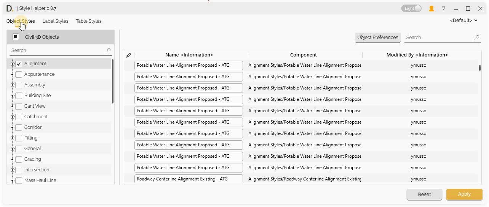

# Style Data Support: Object, Label, and Table Styles
{: .no_toc }

## Table of contents
{: .no_toc .text-delta }

1. TOC
{:toc}

---

# Style Data Support: Object, Label, and Table Styles

Style Helper displays the Civil 3D object styles, label styles, and table styles data in a table interface, where each row represents a style and each column shows a property. You can edit many of these properties directly within the table interface. Some properties are read only and cannot be edited, the interface does not allow you to edit them.

## Overview

Style Helper provides three main tabs that correspond to the different types of styles available in Civil 3D. Each tab displays data in a table format where you can view and edit style properties directly.

The three tabs correspond to Civil 3D's style structure:

- **Object Styles Tab** - Civil 3D object styles (surfaces, alignments, corridors, etc.).
- **Label Styles Tab** - Civil 3D label styles (point labels, parcel labels, etc.).
- **Table Styles Tab** - Civil 3D table styles (quantity takeoff, surface tables, etc.).


<sub>Note: the version on the image may not reflect the [latest version of DiCivil Package](https://diroots.com/civil3D-plugins/DiCivil/).</sub>

## Object Styles Tab

Edit various Civil 3D object styles including display, geometry, analysis, and behavior properties:

- **Surface Styles** - Display and analysis styles for surfaces.
- **Alignment Styles** - Display and annotation styles for alignments.
- **Corridor Styles** - Display and component styles for corridors.
- **Profile Styles** - Display and annotation styles for profiles.
- **Section Styles** - Display and annotation styles for sections.
- **Pipe Styles** - Display styles for pipes and structures.

*Note: The listed styles above are samples of the available object styles. There are many more object types and styles that can be edited in Style Helper.*


<sub>Note: the version on the image may not reflect the [latest version of DiCivil Package](https://diroots.com/civil3D-plugins/DiCivil/).</sub>

## Label Styles Tab

Edit various Civil 3D label styles including text, line, block, and border components:

- **Point Label Styles** - Annotation styles for points.
- **Line Label Styles** - Label styles for lines and curves.
- **Area Label Styles** - Label styles for areas and regions.
- **General Label Styles** - General annotation styles.
- **Profile Label Styles** - Label styles for profiles.
- **Section Label Styles** - Label styles for sections.

*Note: The listed styles above are samples of the available label styles. There are many more label types and styles that can be edited in Style Helper.*


<sub>Note: the version on the image may not reflect the [latest version of DiCivil Package](https://diroots.com/civil3D-plugins/DiCivil/).</sub>

## Table Styles Tab

Edit various Civil 3D table styles including table layout, column properties, header settings, and data formatting:

- **Quantity Takeoff Tables** - Styles for quantity takeoff tables.
- **Surface Tables** - Styles for surface analysis tables.
- **Alignment Tables** - Styles for alignment tables.
- **Profile Tables** - Styles for profile tables.
- **Section Tables** - Styles for section tables.
- **Pipe Tables** - Styles for pipe and structure tables.

*Note: The listed styles above are samples of the available table styles. There are many more table types and styles that can be edited in Style Helper.*


<sub>Note: the version on the image may not reflect the [latest version of DiCivil Package](https://diroots.com/civil3D-plugins/DiCivil/).</sub>

## Component Column Reference

The **Component column** is the fundamental object identification that applies to all three tabs. It uses a naming structure similar to the Civil 3D tree structure, making it easy to locate objects you're working on in Civil 3D.

### Component Path Structure

**Example Component Path:**
```
Alignment Styles/Roadway Centerline Alignment Proposed - ATG/Display/Plan/Line
```

This path structure shows:
- **Object Type** - "Alignment Styles" (matches Civil 3D tree)
- **Object Name** - "Roadway Centerline Alignment Proposed - ATG" (matches Civil 3D tree)
- **Subcomponents** - "Display/Plan/Line" (internal object structure)

### Component Column Examples

#### Object Styles Example
```
Alignment Styles/Roadway Centerline Alignment Proposed - ATG/Display/Plan/Line
Alignment Styles/Roadway Centerline Alignment Proposed - ATG/Display/Plan/Curve
Alignment Styles/Roadway Centerline Alignment Proposed - ATG/Display/Plan/Spiral
```

#### Label Styles Example
```
Point Label Styles/Point Label Style/Text/Text Contents
Point Label Styles/Point Label Style/Line/Leader
Point Label Styles/Point Label Style/Border/Background
```

#### Table Styles Example
```
Surface Table Styles/Surface Table Style/Table Layout/Header
Surface Table Styles/Surface Table Style/Column Properties/Data
Surface Table Styles/Surface Table Style/Data Properties/Formatting
```

### How Component Column Works

The Component column helps you:
- **Locate Objects** - Find exactly which object you're editing in Civil 3D.
- **Identify Subcomponents** - Understand the internal structure of objects.
- **Navigate Hierarchy** - Follow the parent-child relationships.
- **Match Civil 3D Structure** - Directly correlate with Civil 3D's tree structure.

<!-- 
<sub>Note: the version on the image may not reflect the [latest version of DiCivil Package](https://diroots.com/civil3D-plugins/DiCivil/).</sub> -->

