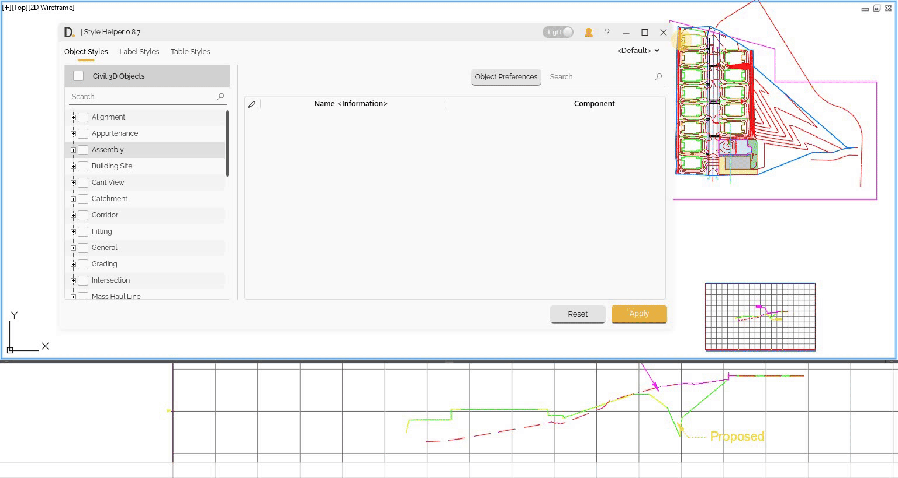

# Profile
{: .no_toc }

## Table of contents
{: .no_toc .text-delta }

1. TOC
{:toc}

---

# Profile

Style Helper profile makes it easy to save your settings and reuse them later.

## What's saved in the profile

The following settings are saved in the profiles:

- The customized Preferences for the Object Styles tab.
- The customized Preferences for the Label Styles tab.
- The customized Preferences for the Table Styles tab.

Note: the version on the image may not reflect the [latest version of DiCivil Package](https://diroots.com/civil3D-plugins/DiCivil/).
