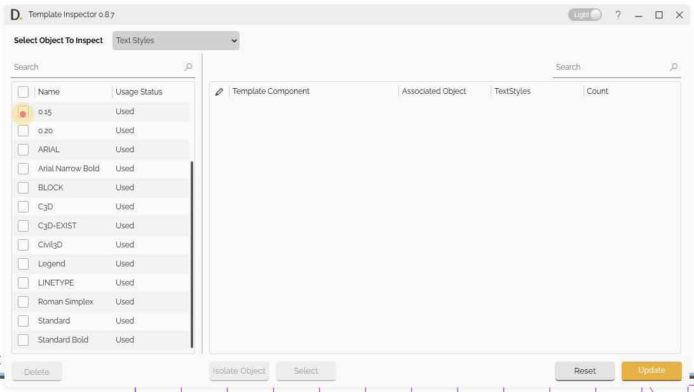
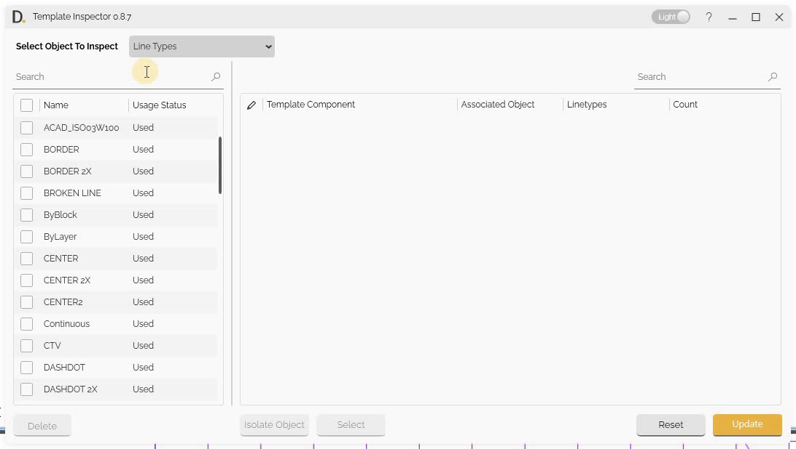

# Delete and Batch Actions
{: .no_toc }

## Table of contents
{: .no_toc .text-delta }

1. TOC
{:toc}

---

# Batch Actions

Template Inspector enables you to perform batch operations on multiple objects simultaneously, significantly improving efficiency when managing large numbers of objects. The batch action feature allows you to select multiple instances and change the assignment of objects from a dropdown selection for all selected inputs at once. Additionally, you can delete objects from the drawing after ensuring they are unused.

## Overview

Delete and batch actions allow you to:
- Select multiple instances simultaneously.
- Change object assignments from dropdown selection for all selected inputs at once.
- Delete unused objects from the drawing.

## Multi-Object  Selection
Select multiple objects for batch operations:

- **Individual Selection** - Select specific objects using checkboxes.
- **Select All** - Select all objects in the current view.
- **Clear Selection** - Clear current selection.

Note: the version on the image may not reflect the [latest version of DiCivil Package](https://diroots.com/civil3D-plugins/DiCivil/).

## Batch Reassignment Workflow

Change object assignments for multiple instances using dropdown selection:

1. **Select Multiple Instances** - Choose multiple instances to modify.
2. **Choose Assignment from Dropdown** - Select new assignment from dropdown for all selected inputs.
3. **Execute Batch Assignment** - Apply assignment changes to all selected instances at once.

Note: the version on the image may not reflect the [latest version of DiCivil Package](https://diroots.com/civil3D-plugins/DiCivil/).

## Object Deletion

Template Inspector provides the ability to delete objects from the drawing, but requires that objects be unused before deletion to ensure data integrity.

### Deletion Workflow

To delete objects safely:

1. **Inspect Objects** - Use the inspection feature to identify which objects are currently in use.
2. **Select Unused Objects for Deletion** - Check the unused objects you want to delete.
3. **Execute Deletion** - Click 'Delete' to remove the unused objects from the drawing.
4. **Confirm Deletion** - A confirmation dialog will appear; confirm the action to proceed.

Note: the version on the image may not reflect the [latest version of DiCivil Package](https://diroots.com/civil3D-plugins/DiCivil/).

### Deletion Requirements

Before objects can be deleted:

- **Unused Status** - Objects must be completely unused (no references or dependencies).
- **Objects are not Constraint** - Objects are not constraint for deletion.
