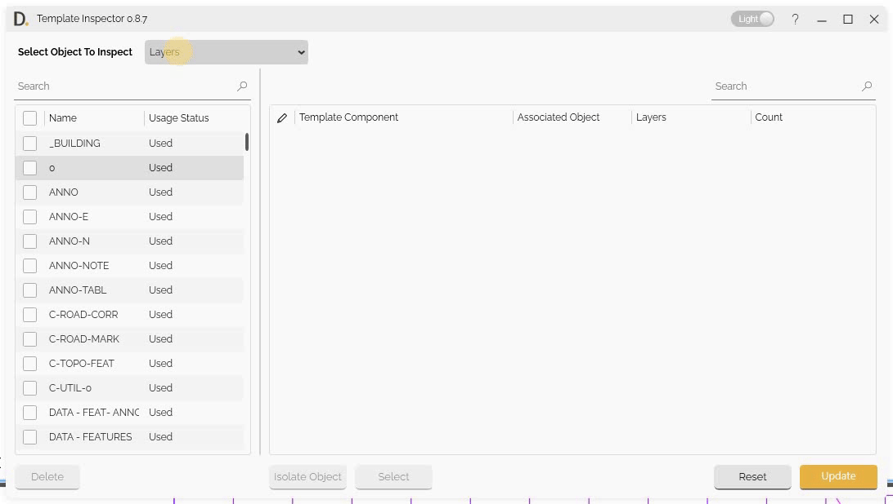
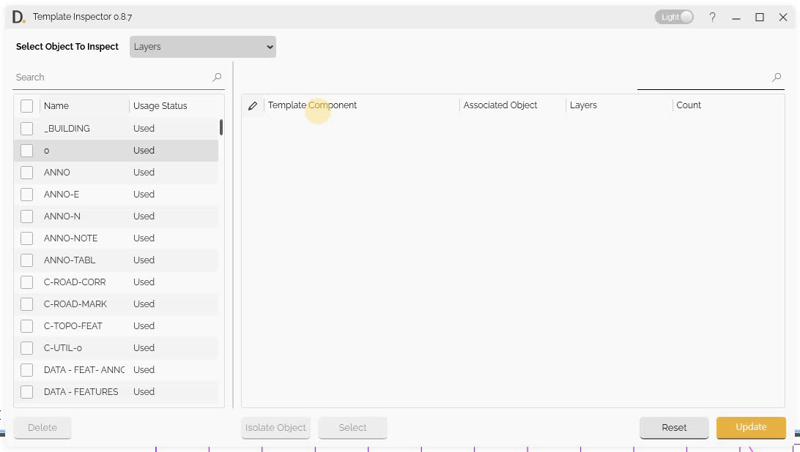

# Object Inspection
{: .no_toc }

## Table of contents
{: .no_toc .text-delta }

1. TOC
{:toc}

---

# Object Inspection

Template Inspector provides object inspection capabilities to examine object properties, usage, and dependencies in detail. The inspection feature performs scans to find object usage and dependencies throughout your settings and objects, providing detailed information about where inspected objects are used.

## Overview

Object inspection allows you to:
- Find all instances where objects are used.
- Find dependencies and references.
- Reassign or swap object property.
- Identify unused objects for cleanup.


### Object Types Supported
- **Layers** - Inspect layer assignment and usage.
- **Line Types** - Find line type assignments and usage.
- **Dimension Styles** - Check dimension style assignments and usage.
- **Hatch Styles** - Locate hatch pattern assignments and usage.
- **Text Styles** - Find text style assignments and usage.

## Object Scan Types

The following scan case types are used to get the object usage throughout drawings:

- **Created Objects** - Check all created objects in the drawing.
- **Settings with Object Assignment** - Find all settings with objects assigned to them.
- **Dependent Objects List** - List all dependent objects and their relationships.
- **Usage Detection** - Find all places where objects are used.
- **Reference Discovery** - Discover object references and dependencies.


<sub>Note: the version on the image may not reflect the [latest version of DiCivil Package](https://diroots.com/civil3D-plugins/DiCivil/).</sub>

## Inspection Workflow

The inspector finds objects that reference the objects being inspected.

1. **Choose Object Type** - Select the type of object to inspect.
2. **Search for Objects** - Search for specific objects.
3. **Select Target Object** - Select the object to inspect.
4. **Examine Dependencies** - Examine object dependencies.
5. **Review Results** - Review inspection results.


<sub>Note: the version on the image may not reflect the [latest version of DiCivil Package](https://diroots.com/civil3D-plugins/DiCivil/).</sub>

## Usage Display

Template Inspector shows usage information to show how objects are used throughout your drawings,  locations, template component and usage counts. The usage count specifically tracks only the objects that are placed or created in the drawing.

### Usage Status

The object table on the left shows if the Object is being used in the column 'Usage Status':

### Usage Display References

The tool displays the references usage information in the following columns:

- **Template Component** - Shows the settings path where the settings use the object.
- **Associated Object** - Shows objects that are created in the drawing that have the inspected object referenced inside their properties.
- **Assigned Object** - Shows the assigned object that can be modified.
- **Count** - Displays usage count information for placed/created objects only.

<!-- 
<sub>Note: the version on the image may not reflect the [latest version of DiCivil Package](https://diroots.com/civil3D-plugins/DiCivil/).</sub> -->

### Component Column Reference

The **Template Component column** identifies the Settings location from the Civil 3D object in the tree structure, making it easy to locate.

#### Component Path Structure

**Example Component Path for Layer:**
```
Alignment Styles/Roadway Centerline Alignment Proposed - ATG/Display/Plan/Line
```
<!-- 
<sub>Note: the version on the image may not reflect the [latest version of DiCivil Package](https://diroots.com/civil3D-plugins/DiCivil/).</sub> -->

## Missing Object Limitations

Due to current Civil 3D API limitations, Template Inspector cannot collect if data is associated to the following:

- **Section View Styles** - Drafting buffer outline.
- **Rail Turnout** - All rail turnout objects.
- **Can't View Styles** - Equilibrium can't line annotation, Applied can't line annotation.
- **Bridge Styles** - All bridge related styles.

The previous mentioned limitations are imposed by the Civil 3D API and are not within the control of Template Inspector. We continue to monitor API updates and will add support for these styles when they become available through the Civil 3D API.
