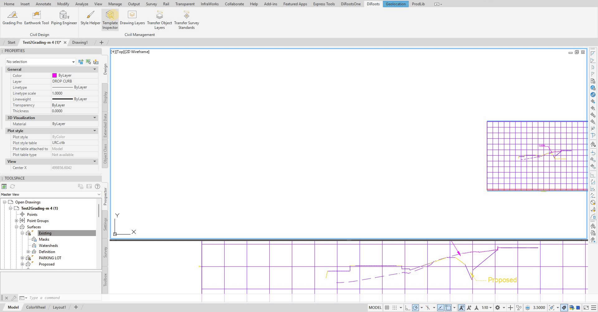

# Template Inspector User Guide

Learn how to use Template Inspector to get object usage, find where they are being used, perform batch modifications and delete them in your files efficiently.

{: .fs-6 .fw-300 }

## Overview

Template Inspector helps you review where objects are used so you can batch modify their assignments, find their associated objects and delete them to clean your files. The supported objects are layers, line types, hatch styles, dimension styles, and text styles.

**Key Features:**
- **Object Inspection** - View associated settings and items for each object.
- **Object Support** - The supported objects are layers, line types, dimension styles, hatch styles, text styles.
- **Batch Reassignment** - Update multiple objects assignment simultaneously.
- **Object Deletion** - Delete unused objects after confirmation.
- **Search and Filter** - Find specific objects using search functionality.

## Getting Started

### Main Interface

The Template Inspector tool is accessed directly from the plugin button. The main interface allows you to:

- **Inspect Objects** - View detailed information about selected objects.
- **Select Object Types** - Choose from layers, line types, dimension styles, hatch styles, text styles.
- **Manage Objects** - Reassign, delete, select, isolate objects.
- **Search Objects** - Find specific objects using search functionality.

### Basic Workflow

1. **Open Template Inspector** - From the plugin button.
2. **Select Object Type** - Choose the type of object to inspect.
3. **Search/Filter** - Use search to find specific objects.
4. **Inspect Objects** - View associated settings and objects.
5. **Manage Objects** - Reassign, select, isolate, delete objects.
<!-- 

Note: the version on the image may not reflect the [latest version of DiCivil Package](https://diroots.com/civil3D-plugins/DiCivil/).
 -->
