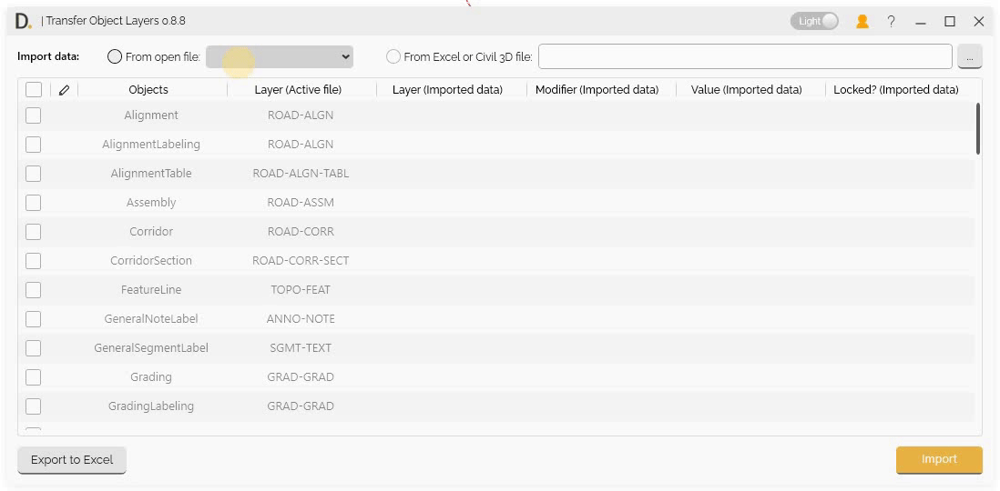
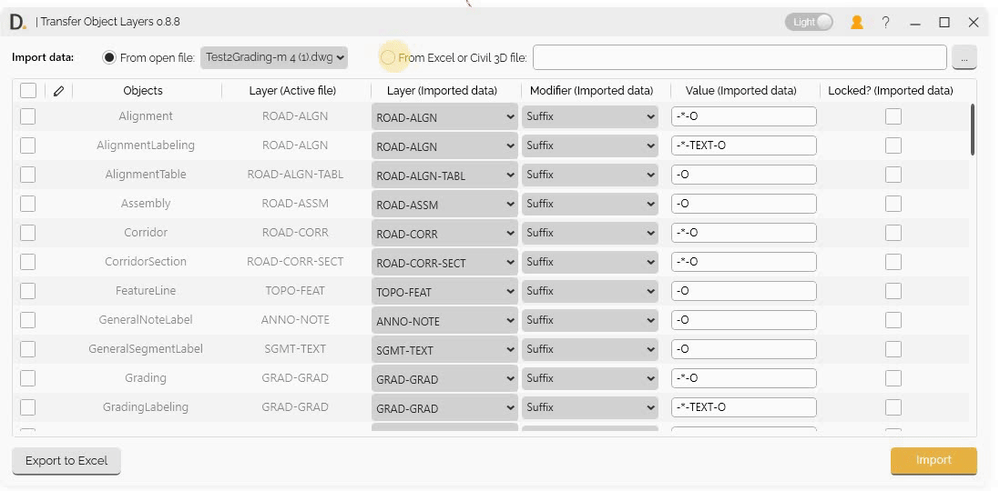
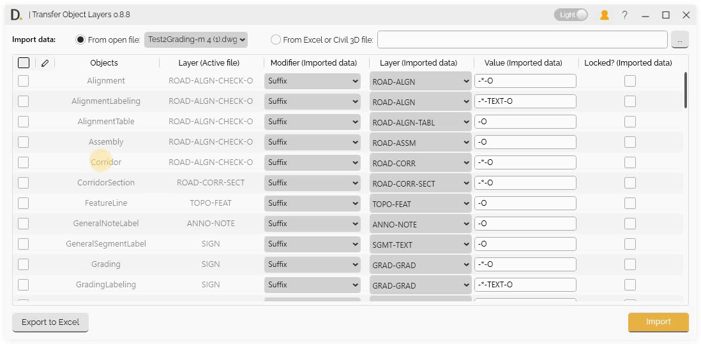
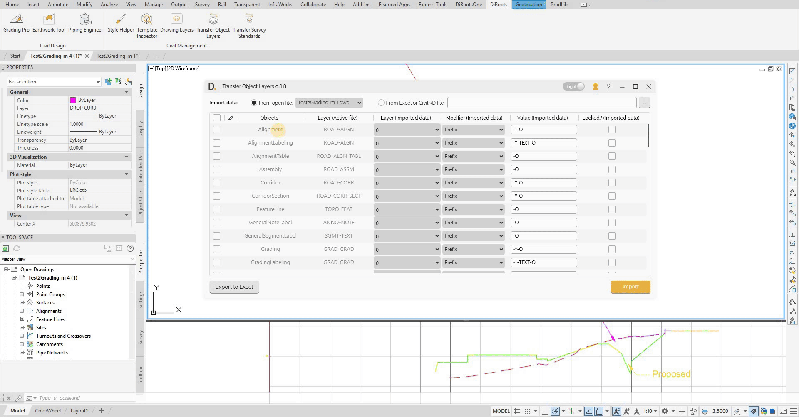
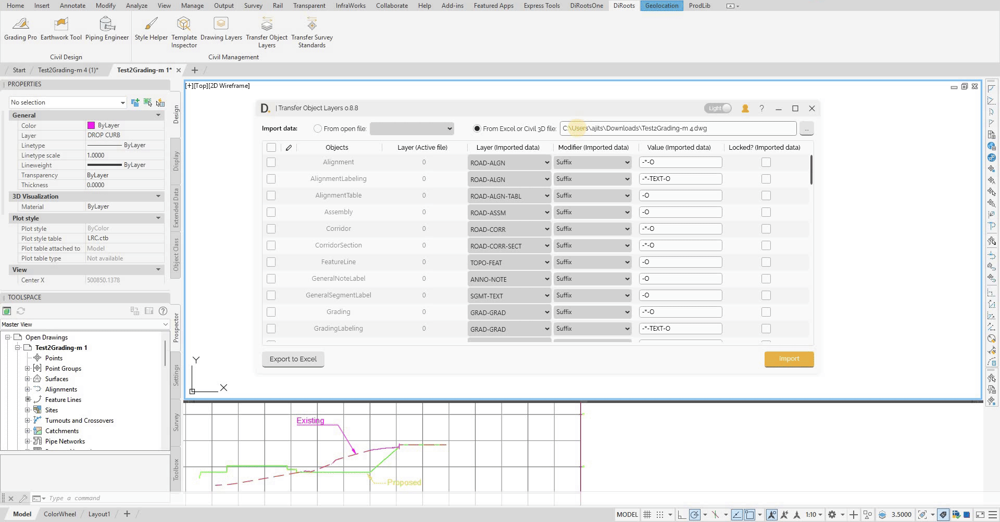

# Transfer Object Layers
{: .no_toc }

## Table of contents
{: .no_toc .text-delta }

1. TOC
{:toc}

---

# Transfer Object Layers

Transfer Object Layers provides comprehensive functionality to transfer Civil 3D object layer settings between projects, including direct file transfer and Excel export/import capabilities for creating and managing standards.

## Overview

Transfer Object Layers allows you to:
- Import object layer data from multiple sources.
- Edit and modify data before transferring.
- Export current file settings as standards.
- Create and manage standards efficiently.
- Share standards across teams.

## Import Options

Transfer Object Layers provides three main ways to import object layer data:

### 1. Import from Open File

Import object layer data from currently open Civil 3D files:

- **File Selection** - Select from currently open Civil 3D files.
- **Direct Import** - Import object layer data directly from open files.

Note: the version on the image may not reflect the [latest version of DiCivil Package](https://diroots.com/civil3D-plugins/DiCivil/).

### 2. Import from Closed File

Import object layer data from closed Civil 3D files:

- **File Browser** - Browse and select closed Civil 3D files.
- **Data Extraction** - Extract object layer data from closed files.
- **Offline Import** - Import data without opening the source file.

Note: the version on the image may not reflect the [latest version of DiCivil Package](https://diroots.com/civil3D-plugins/DiCivil/).

### 3. Import from Excel

Import object layer data from Excel files containing standards:

- **Excel File Selection** - Select Excel files containing object layer data.
- **File Validation** - Validate Excel file format and content.

Note: the version on the image may not reflect the [latest version of DiCivil Package](https://diroots.com/civil3D-plugins/DiCivil/).

## Modify Data Before Transferring

Transfer Object Layers provides data editing capabilities, allowing you to modify object layer data directly in the UI before transferring to your target file.

### Imported Data Display

View all imported object layer data:

Imported object layer data is displayed in a structured table with four main columns:

- Layer.
- Modifier.
- Value.
- Locked. 

This layout allows you to easily review and understand each object’s layer configuration before proceeding with transfer.

### Direct Editing

After importing object layer data, you can edit the data directly in the UI before transferring to your target file.

Note: the version on the image may not reflect the [latest version of DiCivil Package](https://diroots.com/civil3D-plugins/DiCivil/).

## Export to Excel

Transfer Object Layers provides Excel export functionality with two main export options to create and manage standards.

### Export Options

Choose from two export sources:

#### 1. Export Active UI Data

Export the currently displayed and edited data from the UI:

- **Current UI State** - Export data as it appears in the current UI table.
- **Edited Data** - Include any modifications made in the data editing interface.

Note: the version on the image may not reflect the [latest version of DiCivil Package](https://diroots.com/civil3D-plugins/DiCivil/).

#### 2. Export Open Active File

Export object layer data directly from the currently open Civil 3D file:

- **File-based Export** - Export data from the open Civil 3D file.
- **Original Data** - Export original object layer settings without UI modifications.

Note: the version on the image may not reflect the [latest version of DiCivil Package](https://diroots.com/civil3D-plugins/DiCivil/).
