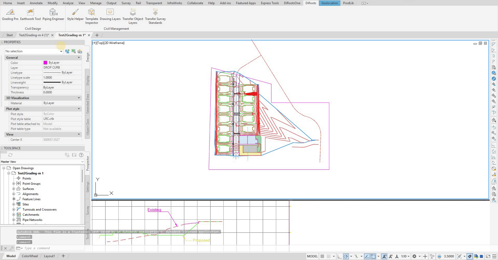

# Transfer Object Layers User Guide

Learn how to use Transfer Object Layers to transfer Civil 3D object layer settings between projects while preserving all layer and properties, includes Excel export and import capabilities.

{: .fs-6 .fw-300 }

## Overview

Transfer Object Layers helps you transfer or migrate Civil 3D drawing object layers settings to any other project or create Excel file format to define your standards. The tool provides two main options: transfer to files directly, and Excel export and import functionality for creating Object Layer Settings standards.

**Key Features:**
- **Two Main Options** - Transfer files directly or Excel file export/import.
- **Multiple Import Sources** - Import from open files, closed files, or Excel.
- **Data Editing** - Modify data directly in the UI before importing.
- **Data Validation** - Warning system for undefined layers.

## Getting Started

### Basic Workflow

1. **Open Target File** - Open the file where you want to import settings.
2. **Open Transfer Tool** - Open Transfer Object Layers tool.
3. **Choose Import Source** - Select from open file, closed file, or Excel.
4. **Import Data** - Import object layer data from source.
5. **Review and Edit** - Review and modify data in the UI.
6. **Apply Settings** - Import all data to target file.

Note: the version on the image may not reflect the [latest version of DiCivil Package](https://diroots.com/civil3D-plugins/DiCivil/).

