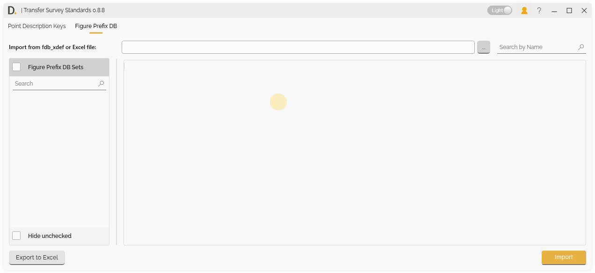
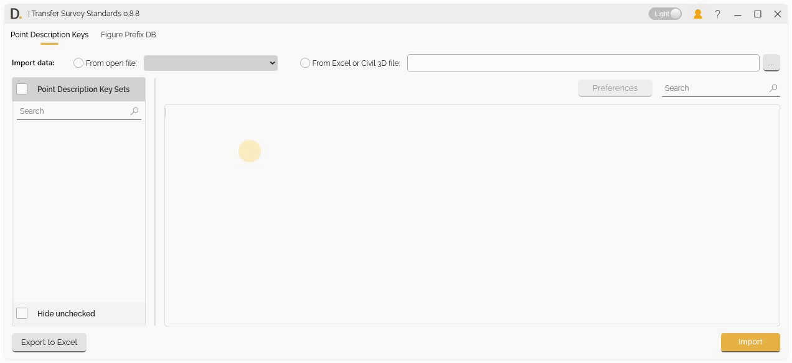
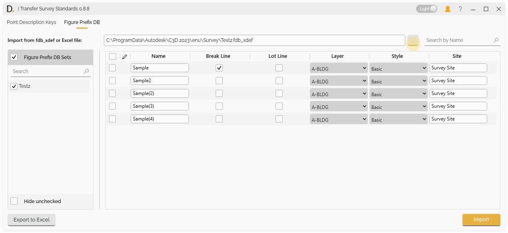
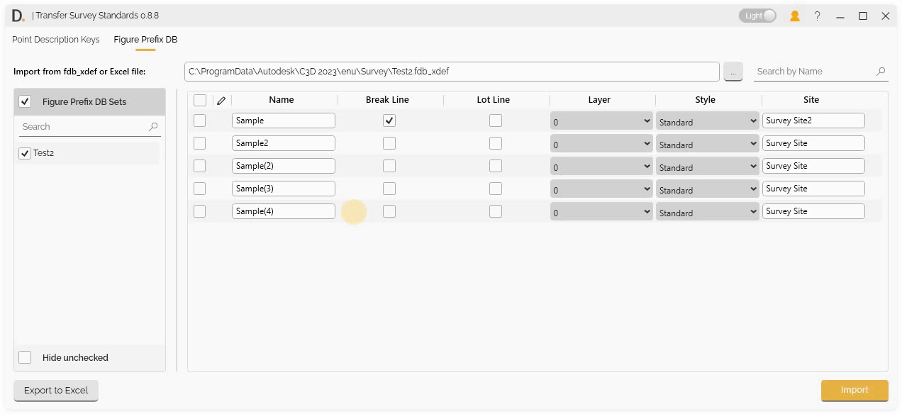
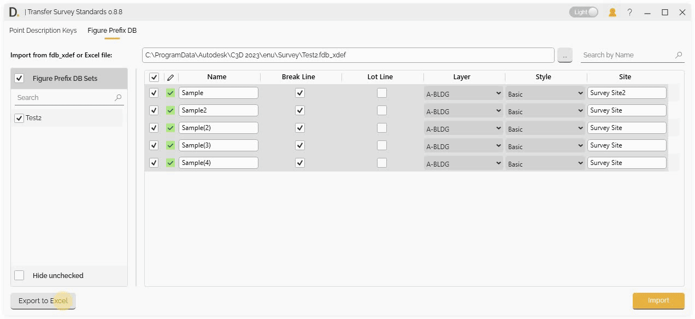

# Transfer Figure Prefix Database
{: .no_toc }

## Table of contents
{: .no_toc .text-delta }

1. TOC
{:toc}

---

# Transfer Figure Prefix Database

Transfer Survey Standards provides Figure Prefix Database transfer and manage figure prefix databases across projects with Excel and .fdb file support.

## Overview

Transfer Figure Prefix Database allows you to:
- Import and modify data before transferring.
- Export current file settings as standards.

Note: the version on the image may not reflect the [latest version of DiCivil Package](https://diroots.com/civil3D-plugins/DiCivil/).

## Import Options

Transfer Survey Standards provides two main ways to import Figure Prefix Database:

### 1. Import from Excel

Import Figure Prefix Database from Excel files:

- **Excel File Selection** - Select Excel files containing Figure Prefix Database data.
- **File Validation** - Validate Excel file format and content.

Note: the version on the image may not reflect the [latest version of DiCivil Package](https://diroots.com/civil3D-plugins/DiCivil/).

### 2. Import from .fdb File

Import Figure Prefix Database from .fdb files:

- **File Browser** - Browse and select .fdb files.
- **Database Import** - Import complete database.

Note: the version on the image may not reflect the [latest version of DiCivil Package](https://diroots.com/civil3D-plugins/DiCivil/).

## Edit and Validate Figure Prefix Database Data Before Transfer

Transfer Survey Standards provides a unified data editing interface for the Figure Prefix Database, allowing you to review, modify, and validate all data directly in the UI before transferring it to your target file.

Note: the version on the image may not reflect the [latest version of DiCivil Package](https://diroots.com/civil3D-plugins/DiCivil/).

## Export to Excel

Transfer Survey Standards provides Excel export functionality with two main export options to create and manage Figure Prefix Database standards.

### Export Options

Choose from two export sources:

#### 1. Export Active UI Data

Export the currently displayed and edited data from the UI:

- **Current UI State** - Export data as it appears in the current UI table.
- **Edited Data** - Include any modifications made in the data editing interface.

Note: the version on the image may not reflect the [latest version of DiCivil Package](https://diroots.com/civil3D-plugins/DiCivil/).

#### 2. Export Open Active File

Export Figure Prefix Database data directly from the currently open Civil 3D file:

- **File-based Export** - Export data from the open Civil 3D file.
- **Original Data** - Export original Figure Prefix Database settings without UI modifications.

Note: the version on the image may not reflect the [latest version of DiCivil Package](https://diroots.com/civil3D-plugins/DiCivil/).

