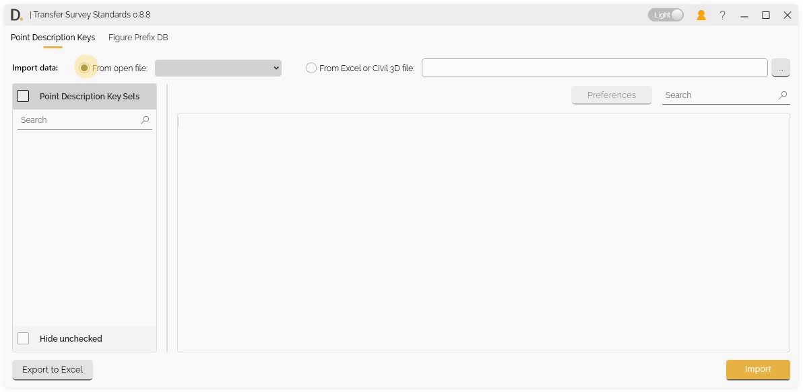
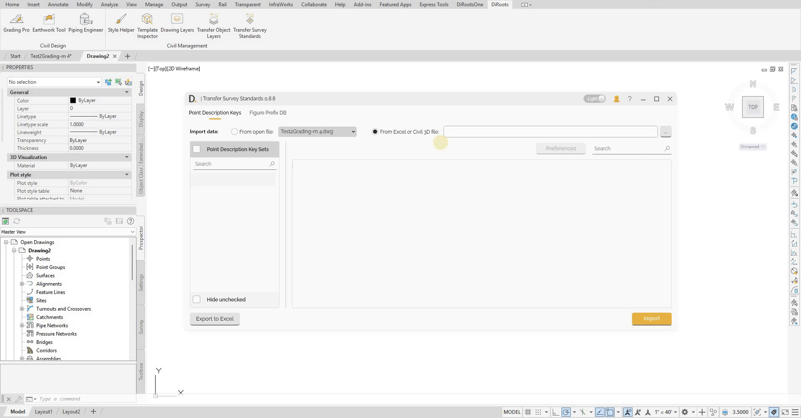
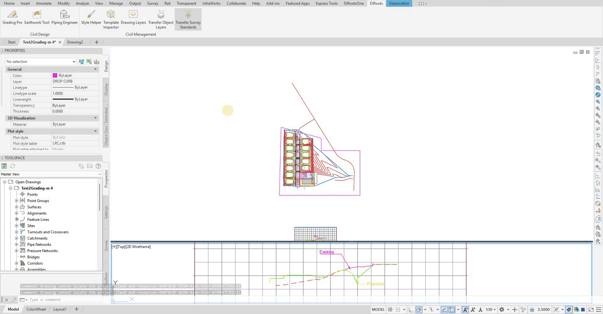

# Transfer Point Description Keys
{: .no_toc }

## Table of contents
{: .no_toc .text-delta }

1. TOC
{:toc}

---

# Transfer Point Description Keys

Transfer Survey Standards allows Point Description Keys (PDKs) transfer between projects, allowing you to transfer PDK configurations between projects with property preservation.

## Overview

Transfer Point Description Keys allows you to:
- Import PDK data from different sources.
- Edit data before transferring.
- Export current file settings or active interface settings.

## Import Options

Transfer Survey Standards provides three main ways to import PDK data:

### 1. Import from Open File

Import PDK data from currently open Civil 3D files:

- **File Selection** - Select from currently open Civil 3D files.
- **Direct Import** - Import PDK data directly from open files.

Note: the version on the image may not reflect the [latest version of DiCivil Package](https://diroots.com/civil3D-plugins/DiCivil/).

### 2. Import from Closed File

Import PDK data from closed Civil 3D files:

- **File Browser** - Browse and select closed Civil 3D files.
- **Data Extraction** - Extract PDK data from closed files.
- **Offline Import** - Import data without opening the source file.

Note: the version on the image may not reflect the [latest version of DiCivil Package](https://diroots.com/civil3D-plugins/DiCivil/).

### 3. Import from Excel

Import PDK data from Excel files containing standards:

- **Excel File Selection** - Select Excel files containing PDK data.
- **File Validation** - Validate Excel file format and content.

Note: the version on the image may not reflect the [latest version of DiCivil Package](https://diroots.com/civil3D-plugins/DiCivil/).

## PDK Data

### Showing PDK Data

After importing, you can check on the left panel  PDK sets you want to view in the main table.

By default, the main table displays the following columns for each Point Description Key: **Code**, **Point Style**, **Point Label Style**, **Format**, and **Layer**. You can customize your view by adding additional data columns through the preferences button, allowing you to see and work with extra properties relevant to your workflow.

### Column Preferences

You can edit the visible table by adding more preference columns as needed. This flexibility allows you to tailor the PDK data view to your workflow—simply add additional columns to track extra preferences, modify or reorder existing columns, and customize the table layout to fit your project requirements and improve visibility.

## Editing PDK Data Before Transfer

Transfer Survey Standards provides a unified data editing interface, allowing you to review and modify Point Description Key (PDK) data directly in the UI before transferring it to your target file.

## Export to Excel

Transfer Survey Standards provides Excel export functionality with two main export options to create and manage PDK standards.

### Export Options

Choose from two export sources:

#### 1. Export Active UI Data

Export the currently displayed and edited data from the UI:

- **Current UI State** - Export data as it appears in the current UI table.
- **Edited Data** - Include any modifications made in the data editing interface.

#### 2. Export Open Active File

Export PDK data directly from the currently open Civil 3D file:

- **File-based Export** - Export data from the open Civil 3D file.
- **Original Data** - Export original PDK settings without UI modifications.

