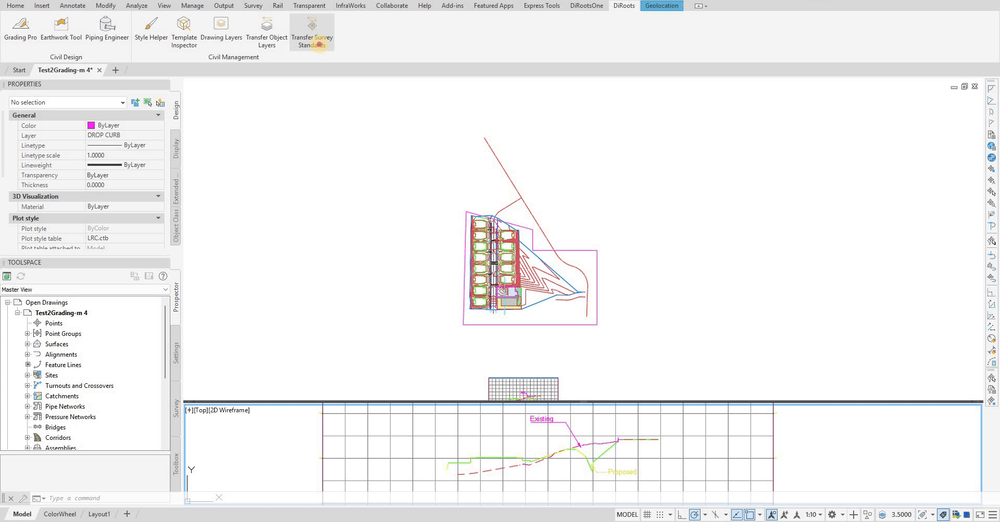

# Transfer Survey Standards User Guide

Learn how to use Transfer Survey Standards to transfer Civil 3D survey standards data between projects and manage Point Description Keys and Figure Prefix Database with Excel export and import capabilities.

{: .fs-6 .fw-300 }

## Overview

Transfer Survey Standards helps you transfer your Civil 3D survey standards data between projects including Point Description Keys and the Figure Prefix Database, and their associated data. Whether you're transferring configuration across projects this tool provides efficient transfer solutions with Excel export and import functionality.

**Key Features:**
- **Transfer Settings and PDKs** - Transfer Point Description Keys between files.
- **Multiple Source Options** - Transfer from open files, closed files, or Excel spreadsheets for PDKs.
- **Figure Prefix Database Transfer** - Transfer figure prefix databases.
- **Excel Export/Import** - Export to Excel for external editing and import back.

## Getting Started

### Basic Workflow

1. **Open Transfer Survey Standards** - From the DiRoots tab.
2. **Choose Transfer Source for PDK** - In the first tab for PDK, Select from open files, closed files, or Excel.
3. **Edit Data** (if needed) - Modify values before applying.
4. **Apply Changes** - Transfer data to target files.

Note: the version on the image may not reflect the [latest version of DiCivil Package](https://diroots.com/civil3D-plugins/DiCivil/).
